# Advanced Protocol Support: Bringing Native gRPC, MQTT, and WebSocket Capabilities to API Dash

### Summary

The main goal of this project is natively integrating **WebSocket**, **MQTT**, and **gRPC** into API Dash to eliminate fragmented testing workflows. By implementing these three protocols natively inside API Dash - with full UI support, live message streaming, dynamic code generation, and robust Riverpod-scoped state management - this project transforms API Dash into the most complete open-source API testing platform available.

**Owner:** rocroshanga@gmail.com  
**Contributors:** Roshan Melvin G A  
**Approvers:** Ankit Mahato (`@animator`), Ashita Prasad (`@ashitaprasad`) 
**Status:** For Review  
**Created:** 31/03/2026

Edited `splitview_equal.dart`: I have found and fixed the bug causing the divider to snap back to the default center position!

### Problem
The `EqualSplitView` ([splitview_equal.dart](file:///home/rocroshan/Desktop/GSOC/apidash/lib/widgets/splitview_equal.dart)) was previously a `StatelessWidget`. Every time you interacted with a widget that caused a rebuild (such as toggling the **View Code** button), `LayoutBuilder` triggered a full rebuild. Due to `EqualSplitView` being stateless, the `MultiSplitViewController` was completely re-instantiated on every single build frame:
```dart
  controller: MultiSplitViewController(
    areas: [
      Area(id: "left", flex: 1, min: minWidth),
      Area(id: "right", flex: 1, min: minWidth),
    ],
  )
```
This wiped out the user's dragged layout/width configuration and unconditionally snapped everything back to `flex: 1` (the perfect center position).

### Solution
1. **Converted `EqualSplitView` to a `StatefulWidget`**: This allows us to persist the controller state across rebuilds.
2. **Initialized `MultiSplitViewController` in `initState()`**: Ensuring the layout state is preserved even when parent widgets rebuild.
3. **Dynamic `minWidth` Updates**: Implemented a `Future.microtask` loop inside `LayoutBuilder` to safely update `minWidth` while preserving the user's manual adjustments.

**Key Code Changes (Issue [#1090](https://github.com/foss42/apidash/issues/1090)):**
```diff
- class EqualSplitView extends StatelessWidget {
+ class EqualSplitView extends StatefulWidget {
...
+ class _EqualSplitViewState extends State<EqualSplitView> {
+   late MultiSplitViewController _controller;
+   @override
+   void initState() {
+     _controller = MultiSplitViewController(areas: [Area(id: "left", flex: 1), Area(id: "right", flex: 1)]);
+   }
```
Now when you drag the divider and click `</> View Code`, the layout is correctly preserved!

---

## Overview

I am **Roshan Melvin G A**, an active contributor to **API Dash** - the open-source, cross-platform API client built with Flutter. My proposal targets **Project Idea: Advanced Protocol Support**, which encompasses the native integration of **WebSocket** (Issue `#15`), **MQTT** (Issue `#115`), and **gRPC** (Issue `#14`) directly into the API Dash client - three of the highest-priority open protocol issues in the repository.

API Dash is a collaboration-driven open-source project that aims to provide developers with a fast, native, cross-platform API testing and development tool. The goal of this project is to eliminate the fragmented workflow that forces IoT engineers, microservice architects, and real-time application developers to jump between MQTTX, wscat, grpcurl, and Postman just to test a single data pipeline.

Before writing this proposal, I shipped a working PoC in PR `#1529` (+17,693 lines across 69 files), currently under active maintainer review. This proposal describes the plan to take that PoC to a fully production-ready, tested, and documented merged implementation.

---

### Personal Information
- **Full Name:** Roshan Melvin G A
- **Contact Info:** rocroshanga@gmail.com | +91-7826860136
- **Discord Handle:** `roshanmelvin`
- **Github Profile:** [https://github.com/roshan-melvin](https://github.com/roshan-melvin)
- **Blog:** [https://dev.to/roshan_melvin](https://dev.to/roshan_melvin)
- **LinkedIn:** [https://www.linkedin.com/in/roshan-melvin-tyech5/](https://www.linkedin.com/in/roshan-melvin-tyech5/)
- **Resume:** [https://drive.google.com/file/d/195X3Ix5Q1sqyCQkNf_FjvrRBmP6azFIO/view?usp=drive_link](https://drive.google.com/file/d/195X3Ix5Q1sqyCQkNf_FjvrRBmP6azFIO/view?usp=drive_link)
- **Drive**: [https://drive.google.com/drive/folders/1Z7EYSo1tfBuiQFm4gLXbVxEF2iwIC9iV?usp=drive_link](https://drive.google.com/drive/folders/1Z7EYSo1tfBuiQFm4gLXbVxEF2iwIC9iV?usp=drive_link)
- **Time Zone**: IST (+5:30)

### University Information
- **University Name:** Sri Sairam Engineering College, Chennai
- **Program Enrolled In:** Bachelor of Engineering in Computer Science and Engineering (Internet of Things)
- **Year:** Third Year (2023–2027)
- **Expected Graduation Date:** 2027

---

## 1. Motivation & Past Experience

**Have you worked on or contributed to a FOSS project before? Can you attach repo links or relevant PRs?**

Yes. Before writing this proposal, I built the thing. PR `#1529` - submitted directly against `foss42:main`, reviewed by API Dash maintainers, 8 commits, 69 files changed, **+17,693 lines** - implements a fully working PoC for WebSocket, MQTT, and gRPC natively inside API Dash. The PR is currently open awaiting a video demo which I am recording, and it is the primary evidence for everything in this proposal.

- **Open PR [#1529](https://github.com/foss42/apidash/issues/1529):** [https://github.com/foss42/apidash/pull/1529](https://github.com/foss42/apidash/pull/1529)
- **Active Development Branch:** [`feat/gsoc-2026-protocol-support`](https://github.com/roshan-melvin/apidash/tree/feat/gsoc-2026-protocol-support)

> **Maintainer Review Status:** The PR has been reviewed by `@ashitaprasad`. The maintainer applied the `needs: demo-video` label and explicitly requested a video walkthrough of the working PoC - which I am recording now. This is the only open action item before the PR moves to the next review stage.

To prove the depth of research behind the PoC - not just the code - I published a technical deep-dive on the architectural trap that silently kills naive WebSocket implementations in Flutter: the `channel.ready` timing problem. Maintainers and community members can read it here: [Why Your WebSocket Messages Silently Vanish: The `channel.ready` Trap in Dart](https://dev.to/roshan_melvin/why-your-websocket-messages-silently-vanish-the-channelready-trap-in-dart-3mi5). Writing that article required tracing the full WebSocket handshake at the TCP level - the same analysis that informed the implementation.

**What is your one project/achievement that you are most proud of? Why?**
I am most proud of PR `#1529` (+17,693 lines). Before writing any feature code, I read every closed protocol PR thread ([#210](https://github.com/foss42/apidash/issues/210), [#215](https://github.com/foss42/apidash/issues/215), [#258](https://github.com/foss42/apidash/issues/258), [#555](https://github.com/foss42/apidash/issues/555), [#1003](https://github.com/foss42/apidash/issues/1003), [#1017](https://github.com/foss42/apidash/issues/1017)) to identify the exact architectural mistakes - specifically reusing API Dash's HTTP state model - that killed those implementations. I engineered a fully dedicated `Hive` and `Riverpod` data layer to fix these root causes permanently. The PR implements a complete working PoC for WebSocket, MQTT, and gRPC, and it is currently under active review by maintainers.

**What kind of problems or challenges motivate you the most to solve them?**
I am motivated by low-level networking challenges. Working extensively with Docker, ROS2, and embedded hardware architectures (ESP32/Arduino) taught me the severe cost of bad state management. I love figuring out how to handle real-time, asynchronous streams of data - like managing thousands of WebSocket frames without causing the main UI to freeze or lag.

**Will you be working on GSoC full-time?**
Yes, I am fiercely committed to working on GSoC full-time. I will dedicate over 40 hours a week to completing this project.

**Do you mind regularly syncing up with the project mentors?**
Not at all. I believe transparent communication prevents wasted time and technical debt. I am available for daily asynchronous updates on Discord and weekly Google Meet syncs to validate UI and architectural decisions.

### Why API Dash?

I chose **API Dash** for my Google Summer of Code project because I wanted to work on an open-source tool that has a direct, tangible impact. API Dash powers API development for thousands of engineers, and the idea that my contributions could drastically improve their testing workflows and debugging speed is what drew me to it. Furthermore, it proves that you don't need heavily threaded memory sinks (like Electron) to build world-class API tooling; compiling natively via Flutter and Dart provides a lightning-fast application capable of massive scalability.

Another reason is that I wanted to tackle **advanced networking and state management**. I have been building high-level applications, and I was eager to dive into systems-level programming concepts within Flutter, exploring raw socket handling, isolate concurrency, and protocol streaming. API Dash's strict Riverpod and Hive architecture seemed like the perfect fit to apply and expand my technical depth in a meaningful way.

Finally, I was looking for a **challenging project**-something that would push me beyond my comfort zone. Integrating three fundamentally diverse protocols natively requires robust problem-solving skills and intricate system interoperability. Through this project, I hope to **become a better problem solver**, understand how massive open-source tools scale, and contribute to something that truly makes a difference.

### Prior Experience with Open Source

API Dash is my central open-source organization. Over the past few months, I have deeply analyzed the codebase and actively contributed to integrating complex architectural features. My consistent involvement has proven my familiarity with the repository's code review standards, CI/CD pipelines, and Riverpod patterns.

List of Contributions So Far:
1) Core Native Protocol Expansion (WebSocket, MQTT, gRPC) - PR [#1529](https://github.com/foss42/apidash/issues/1529) (Under Review)
2) Fix Layout overflow when focusing on URL field - Issue [#1535](https://github.com/foss42/apidash/issues/1535) (Currently Working)
3) Request/Response pane widths reset when toggling View Code - Issue [#1090](https://github.com/foss42/apidash/issues/1090) (Currently Investigating - directly related to `protocol_code_pane.dart` rewrite in the PoC)
4) Resolve RenderFlex overflow in AIModelSelector - Issue [#1508](https://github.com/foss42/apidash/issues/1508) (Next Priority)

**Can you mention some areas where the project can be improved?**
Beyond my core proposal, API Dash has incredible potential in:
- **UI Overflow & Stability Configurations:** Noting recent repository issues (like `#1535 Layout overflow when focusing on URL field`, `#1508 RenderFlex overflow in AIModelSelector`, `#1360`, and `#1090`), API Dash could drastically benefit from enforcing strict layout boundary testing using integration test suites.
- **Protocol State Decoupling:** Continuing the architectural migration flagged by `#1017` and `#1003` to strictly decouple protocol logic from UI state, ensuring that legacy HTTP state models never pollute new protocols.
- **Test Automation via CLI:** Creating a headless Dart runner that executes API Dash requests natively in CI/CD pipelines (GitHub Actions).

**Have you interacted with and helped the API Dash community? (GitHub/Discord links)**
Yes! I am active on the official Discord (`roshanmelvin`) discussing protocol constraints and Riverpod state configurations. More concretely, I have opened PR `#1529` - a full working PoC of WebSocket, MQTT, and gRPC support submitted directly against `foss42:main`. The PR includes 8 commits across 69 files (+17,693 lines) and has been reviewed by maintainers. I am currently recording the video demo requested in the review label and will address all feedback during the GSoC period.

---

## 2. Project Proposal Information

### Proposal Title
**Advanced Protocol Support: Bringing Native MQTT, WebSocket, and gRPC Capabilities to API Dash**

### Relevant GitHub Issues Attacked:
- **WebSocket Protocol Implementation:** Issue `#15`
- **MQTT Feature Integration:** Issue `#115`
- **gRPC Protocol Expansion:** Issue `#14`

### Protocol Overview

The three target protocols serve fundamentally different domains. This table exists as a navigation reference - the architectural decisions that follow are what matter:

| Protocol | Primary Domain | Wire Format | Connection Model |
|---|---|---|---|
| **WebSocket** | Real-time web, live chat, collaborative apps | Text / Binary frames (RFC 6455) | Long-lived full-duplex over HTTP/1.1 upgrade |
| **MQTT** | IoT telemetry, sensor networks, embedded systems | Binary packet (PUBLISH, SUBSCRIBE, CONNECT) | Persistent broker-mediated pub/sub over TCP |
| **gRPC** | Microservice-to-microservice, Kubernetes mesh | Protobuf binary over HTTP/2 frames | Multiplexed streams on a single TCP connection |

### Abstract

While debugging *Titan Personal Assistant* - my production ESP32/MQTT system - I had four tools open simultaneously just to test one data pipeline: a serial monitor for the microcontroller, MQTTX for broker messages, a REST client for the Flask backend, and a WebSocket terminal for the live feed. One pipeline. Four tools. That shouldn't be necessary - and it is entirely unnecessary for any developer working across protocol boundaries today.

The problem is universal: standardizing testing across protocols forces a fragmented workflow. An IoT engineer testing an ESP32 must use MQTTX for sensor telemetry, switch to Postman for REST APIs, and use wscat for WebSocket testing. Every context switch is friction. Every separate tool is a gap where data can disappear and debugging becomes archaeology.

**My proposal solves this fragmentation.** The PoC (live in PR `#1529`) is already working against real public infrastructure: `broker.hivemq.com` (MQTT), `wss://echo.websocket.events` (WebSocket), and `grpcb.in:9000` (gRPC). This proposal describes the plan to take that working PoC to a production-ready, merged implementation. Unlike all previous PRs, this implementation supports both **MQTT v3.1.1 and v5.0** with a dual-client engine that dynamically routes connections without breaking the core architecture. Developers will be able to manage all their API testing from a single native application, including UI-driven protocol inspection, connection persistence, live Rx/Tx metrics, and dynamic code generation across Dart, Python, and JavaScript.

### Pre-Implementation Study

Before writing a single line of feature code, I read every closed protocol PR thread (`#210`, `#215`, `#258`, `#555`, `#1003`, `#1017`) and mapped every MQTT, WebSocket, and gRPC concept to its corresponding Dart package API. For MQTT specifically, I traced the full `mqtt_client` publish/subscribe flow against [OASIS MQTT v3.1.1 §3.2.2.3](https://docs.oasis-open.org/mqtt/mqtt/v3.1.1/mqtt-v3.1.1.html) before writing the service layer - so that my implementation of QoS guarantees, CONNACK decoding, and LWT registration maps precisely to the protocol specification rather than the package's default happy path.

### Video Walkthroughs (Working PoC)

Before reviewing the architecture breakdowns, please watch the actively working PoC (integrated in PR `#1529`) functioning natively against real servers:

**Complete Protocol Overview (All Features)**


https://github.com/user-attachments/assets/2a89d590-d32e-4fab-9f9e-a78528da2659


**MQTT v3.1.1 + v5.0 Demo (`broker.hivemq.com`)**


https://github.com/user-attachments/assets/7cea55a7-85af-4569-947b-cd23fe63a4f0


**WebSocket Engine Test (`wss://echo.websocket.events`)**


https://github.com/user-attachments/assets/fd396060-0d94-4951-ac8d-b2bc55892abe


**gRPC Reflection & Unary Call (`grpcb.in:9000`)**


https://github.com/user-attachments/assets/2d022ad2-fcf5-4bd8-a7c2-bc882bd92520


---

## 3. Why Previous Attempts Failed - And How This Implementation Is Different

Issue [#15](https://github.com/foss42/apidash/issues/15) (WebSocket) has been open since April 2023. Issue [#115](https://github.com/foss42/apidash/issues/115) (MQTT)
since February 2024. Neither has ever been merged. Understanding exactly
why is essential to understanding why this proposal will succeed.

### WebSocket: PR [#210](https://github.com/foss42/apidash/issues/210) (closed March 2024)

PR [#210](https://github.com/foss42/apidash/issues/210) by sebastianbuechler added a `WebSocketManager` and basic UI,
but the author self-identified the core problem before closing it:
**state persistence**. The implementation stored connection state inside
widget state, not in Riverpod providers. When a user switched tabs, the
entire connection - messages, status, socket handle - was lost. The
author noted headers weren't incorporated into the connection, and
listed open items including query param handling on reconnect. The
maintainer (`@ashitaprasad`) requested changes referencing issue [#307](https://github.com/foss42/apidash/issues/307)
(protocol dropdown unification); the PR was never updated and was
closed by the author.

**My fix:** `WebSocketConnectionManager` is a global singleton keyed
by request ID, with state living entirely in Riverpod family providers.
Tab switching never touches the connection because no state lives in
widget scope.

### MQTT: PR [#258](https://github.com/foss42/apidash/issues/258) (closed May 2024)

PR [#258](https://github.com/foss42/apidash/issues/258) by mmjsmohit implemented basic `mqtt_client` connectivity and
topic subscriptions. It was reviewed by the maintainers and hit two
fatal problems:

1. **State sharing between requests:** Maintainer `@ashitaprasad`
   flagged: *"Every time I create a new MQTT request, the response and
   request fields of the previous MQTT request get filled."* The MQTT
   state was stored globally, not scoped to a request ID.

2. **Wrong model architecture:** The author asked *"Should I create a
   new model specifically for MQTT, or modify the existing request
   model?"* The maintainer's reply was clear: *"It should be a new
   model."* The PR had been built on top of `HttpRequestModel` - the
   same mistake that caused [#210](https://github.com/foss42/apidash/issues/210) to fail for WebSocket.

The PR was closed by `@ashitaprasad` in May 2024 with the note:
*"Closing this PR as request model has now been updated."* When another
contributor asked to revive it in 2025, `@ashitaprasad` responded:
*"Better to start things from scratch as the codebase has evolved."*

**My fix:** `MqttRequestModel` is a fully separate Hive type. MQTT
state is held in Riverpod family providers scoped per request ID -
creating a second MQTT request never touches the first.

### The Pattern: One Root Cause

Both PRs failed for the same reason (which directly echoes the architectural warnings raised in `#1017` and `#1003`): they tried to reuse
`HttpRequestModel` and stored protocol state in widget scope rather
than in the provider tree. My implementation addresses this at the
data model level from day one:
```dart
// Each protocol gets its own dedicated Hive model
@HiveType(typeId: 5)
class MqttRequestModel { ... }

@HiveType(typeId: 6)  
class WebSocketRequestModel { ... }

// State is scoped per request ID, surviving tab switches
final wsStateProvider = StateNotifierProvider.family<
  WsStateNotifier, WsState, String>((ref, requestId) => ...);
```

This is the exact architectural change the maintainers asked for in
both [#258](https://github.com/foss42/apidash/issues/258) and [#210](https://github.com/foss42/apidash/issues/210). I read those threads before writing a single line
of code.

### Unified High-Level Architecture Overview

A core reason all previous protocol PRs (`#210`, `#258`, `#555`) were rejected is that contributors bolted new protocol logic onto the existing HTTP-centric model layer - causing shared state, cross-contamination, and architecture violations. My implementation solves this permanently by treating every protocol as a fully isolated vertical pillar inside the **same shared 4-layer architectural stack** that API Dash already uses for HTTP.

The four layers - **Model → Service → Provider → UI** - map precisely to API Dash's own design philosophy:

- **Model Layer (Hive Persistence):** Every protocol owns a distinct, typed Hive class (`MqttRequestModel` TypeId: 5, `WebSocketRequestModel` TypeId: 6, `GrpcRequestModel` TypeId: 7). No protocol ever touches another's data schema. This is the fundamental fix the maintainers explicitly requested in the PR review threads.

- **Service Layer (Network Engines):** Each protocol has a dedicated, singleton network manager scoped to a request ID: `WebSocketConnectionManager` (using `dart:io`), the dual-engine MQTT client (`mqtt_client` for v3.1.1 and `mqtt5_client` for v5.0), and the custom `GrpcProtobufCodec` with isolated Reflection and Main HTTP/2 channels.

- **Provider Layer (Riverpod Global Scope):** All protocol state lives in `StateNotifierProvider.family` scoped per `requestId`. This prevents the exact cross-contamination bug reported in PR `#258` - where creating a second MQTT request filled the first one's fields. Switching UI tabs never destroys or shares connection state because no state lives in widget scope.

- **UI Layer (Flutter Widgets):** Each protocol renders its own dedicated Request Pane (`WebSocketRequestPane`, `MqttRequestPane`, `GrpcRequestPane`). They consume state exclusively from their scoped Riverpod providers, keeping the UI fully declarative and reactive.

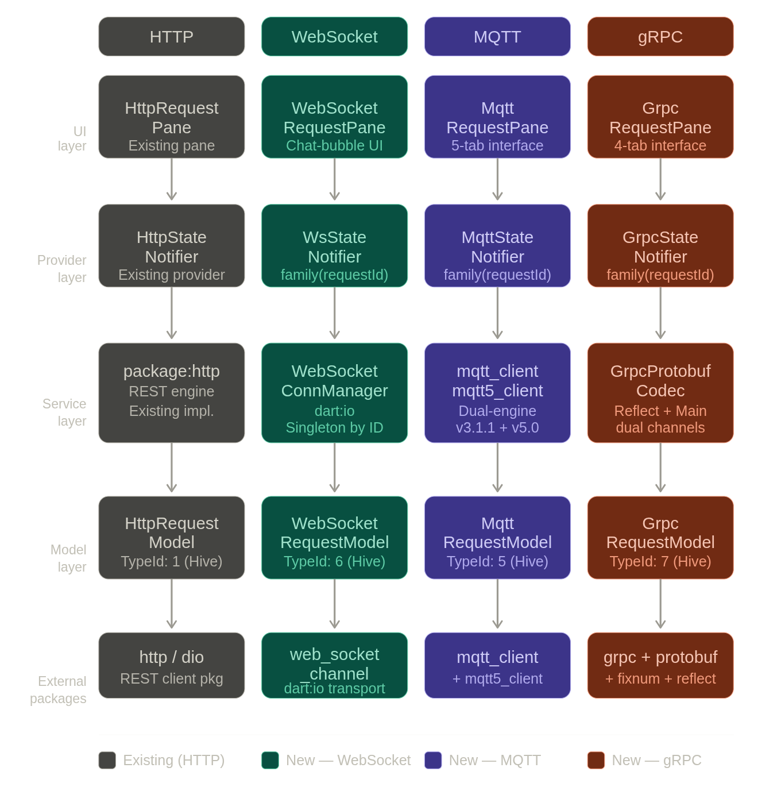

---

## 4. WebSocket Subsystem (Priority 1)

**Use Case:** A developer constructing a real-time collaborative code editor or live-chat subsystem requires long-lived duplex channels to test authentication handshakes (`Sec-WebSocket-Key`) and track server pong messages.

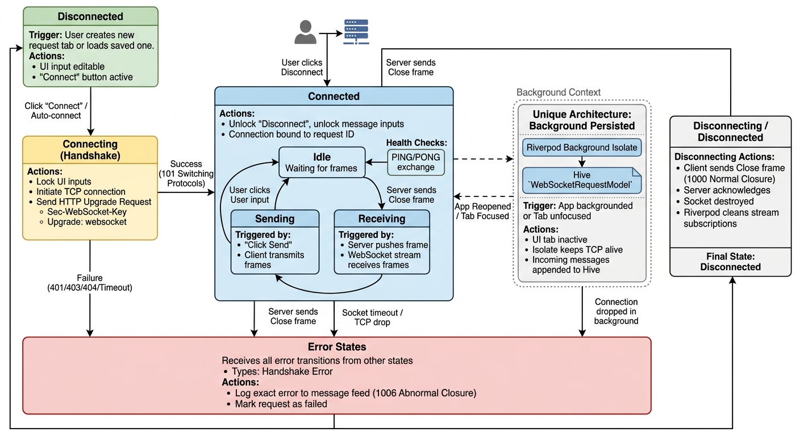

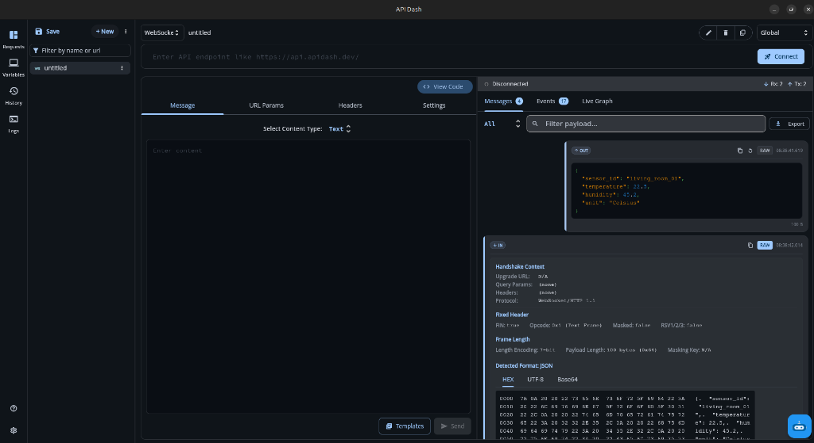

#### Spec-Level Implementation Detail: Why `channel.ready` Is Non-Trivial

A subtle timing bug affects naive WebSocket implementations: calling `connect()` returns **immediately** - but the socket is not yet usable. The full sequence under the hood is:
1. TCP 3-way handshake (SYN → SYN-ACK → ACK)
2. Optional TLS handshake (ClientHello → ServerHello → Certificate → Finished)
3. HTTP Upgrade request (`Upgrade: websocket`, `Sec-WebSocket-Key`) → Server responds `101 Switching Protocols`

Only after all three phases complete does the channel enter a readable state - **but `connect()` resolves after step 1, not step 3.** Any implementation that writes to the socket before `channel.ready` resolves will silently drop frames. My `WebSocketConnectionManager` explicitly `await`s `channel.ready` before unlocking the UI send button and attaching the incoming stream listener, guaranteeing zero dropped handshake frames.

#### Specific Implementations:
- **Duplex Connectivity Manager:** Implemented via `WebSocketConnectionManager`, utilizing bounded Streams that are explicitly tied to the UI Request ID. Unlocks send state only after `channel.ready` resolves, preventing silent frame drops during TLS negotiation.
- **Chat-Bubble Viewport UI:** A `ListView.builder` employing `reverse: true` ensures the newest incoming messages always stay at the bottom of the view without massive layout rebuilds.
- **RAW Protocol Inspector:** The RAW protocol inspector exposes what wscat, grpcurl, and MQTTX show in a terminal - byte-frame boundaries, handshake headers, CONNACK metadata - directly inside the GUI. This is what makes API Dash useful for debugging protocol-level failures, not just happy-path testing. Implemented for all three protocols.
- **Binary Stream Audio Execution:** Added an explicit `uint8_audio_player` mapping inside the Response Body to directly execute binary streams containing raw audio payloads, drastically enhancing IoT output capability.

---

## 5. MQTT Core Pipeline & Live Graphing (Priority 2)

**Use Case:** An IoT hardware engineer deploying ESP32s pushing accelerometer metrics needs to analyze stream flow, simulate dropping payloads, and generate `Last Will` messages to ensure their backend tracks offline nodes properly.

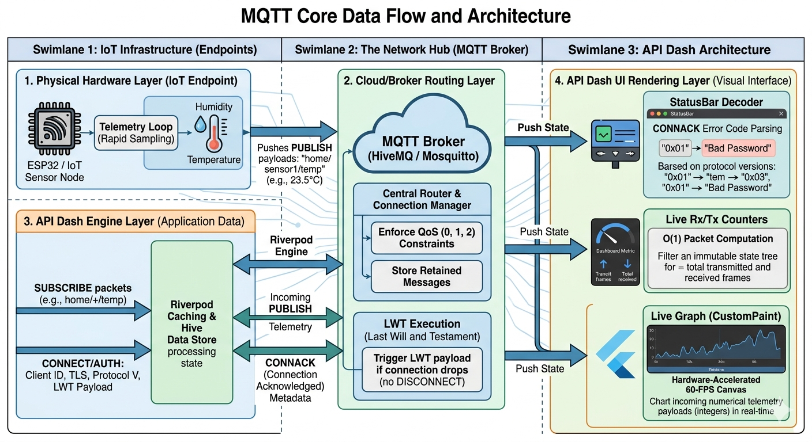

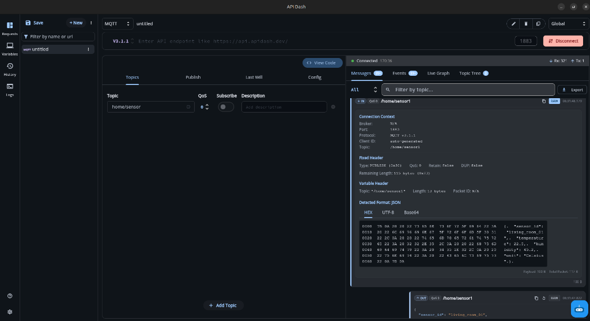

### MQTT Request Pane: Four-Tab Interface

MQTT is fundamentally different from HTTP - it has no concept of a simple request/response. It requires persistent connection management, topic-based pub/sub routing, quality-of-service guarantees, and Last Will configuration. To mirror this complexity, the MQTT Request Pane organizes all configuration into **four dedicated tabs**:

- **Tab 1 - Topics (Subscriptions):** Where the user defines which topic filters to listen on. Each row specifies a Topic, QoS level (0, 1, or 2), a Subscribe toggle, and an optional description. Supports wildcard patterns (`+` single-level, `#` multi-level). The `[ + Add Topic ]` button lets engineers add multiple independent subscriptions before connecting.

- **Tab 2 - Publish:** Where the user composes outgoing MQTT `PUBLISH` messages. Contains the topic field, message body editor, QoS level selector, and the `Retain` flag toggle that persists the last message at the broker for late-joining subscribers.

- **Tab 3 - Last Will & Testament (LWT):** The broker publishes this pre-configured message automatically if the client disconnects ungracefully (e.g., WiFi cut, app kill). Configuration includes the Will Topic, Will Payload, Will QoS, and Will Retain flag - all mapped directly into the MQTT `CONNECT` packet handshake.

- **Tab 4 - Config:** Contains all connection-level settings: Client ID, Username/Password for broker auth, Protocol Version toggle (`v3.1.1` vs `v5.0`) which dynamically switches the underlying Dart client engine, TLS/SSL toggle, Clean Session flag, and Keep-Alive interval.

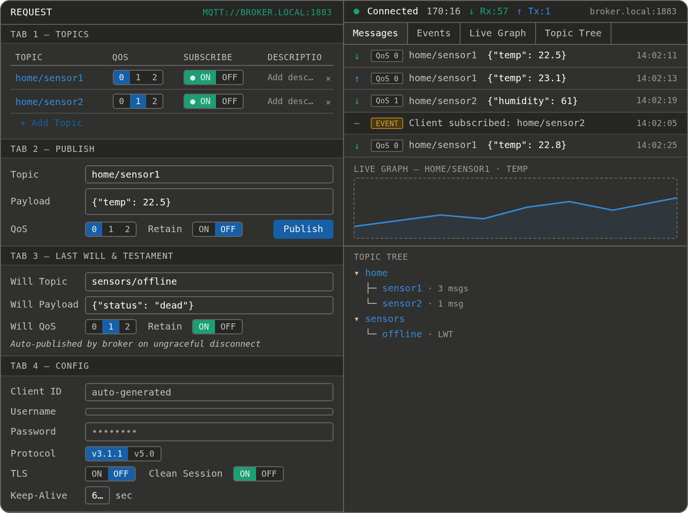

#### Specific Implementations:
- **Asymmetric Subscription Array:** A dedicated request pane with tabs for: Payload (Publish), Subscriptions (QoS definitions), Auth, and Last Will (LWT) configurations.
- **Topic Tree Navigation:** Automatically recursively parses raw slashes (e.g. `home/sensor1`) into an expandable TreeView of discovered hardware endnodes.
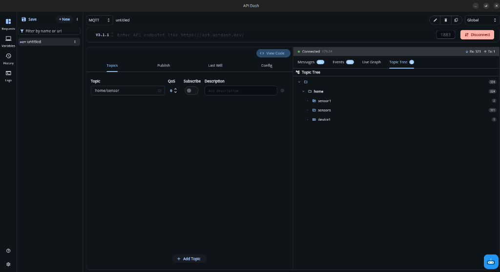
- **Native 60-FPS Live Graph Render:** Standard text columns crash when IoT sensors update 150 times a second. I am implementing a `CustomPaint` based `MQTTGraphPainter` to plot mathematical points securely on a hardware-accelerated canvas, giving users a smooth, pinch-to-zoom timeline interface.
- **Connection Templates:** Pre-configured templates for common public brokers (e.g., HiveMQ, Mosquitto) and WebSocket endpoints to accelerate initial developer testing.
- **Sequence Replay Harness:** An explicit message replay mechanism will allow engineers to loop a recorded publish sequence, acting as a vital test harness for downstream IoT logic.

---

## 6. gRPC Server Reflection (Priority 3)

Because Dart's standard gRPC libraries do not statically map arbitrary payloads at runtime, I engineered a fully custom byte encoder (`GrpcProtobufCodec`) entirely from scratch natively within `grpc_reflection_service.dart`. This custom parser dynamically maps and serializes all 15 core protocol buffer scalar wire types (varints, IEEE-754 floats, zigzag ints, UTF-8 strings, and raw byte arrays) directly into JSON. Delivering hyper-stable Unary boundaries alongside robust Server Streaming calls, coupled with exhaustive Server Reflection exploration, establishes the exact protocol capabilities API Dash needs to dominate the gRPC ecosystem.

**Use Case:** A microservice architect needs to securely test internal endpoints running across a Kubernetes mesh using complex Protocol Buffers encoding.

### gRPC Communication Modes

gRPC exposes four communication patterns over a single HTTP/2 multiplexed TCP connection. My implementation handles all four - the full scope of `grpcurl` - surfaced in a GUI client. Briefly: **Unary** (single request → single response), **Server Streaming** (single request → infinite frame stream, bound directly to the UI listener), **Client Streaming** (batch frames → single summary response), and **Bidirectional Streaming** (concurrent independent read/write streams on the same channel without cross-contamination).

The non-obvious architectural decision here is the **dual-channel isolation** between reflection and RPC execution - explained in the implementation details below - which none of the prior attempts attempted.

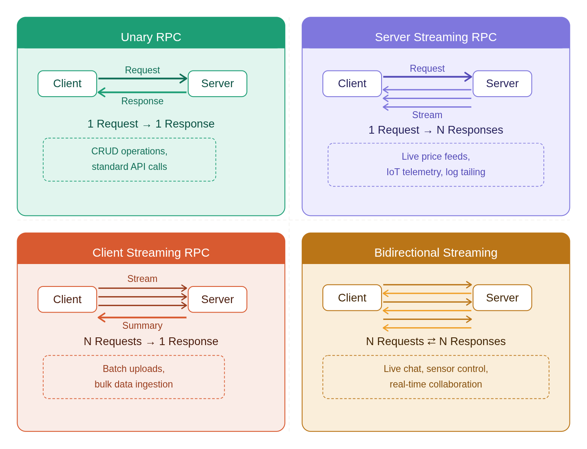

### gRPC Request Pane: Four-Tab Execution Layout

To ensure a consistent user experience with standard HTTP endpoints while satisfying the complex payload requirements of HTTP/2 RPCs, the gRPC execution environment utilizes a dedicated 4-tab interface:

- **Tab 1 - Payload (Message):** An interactive JSON editor where the developer writes un-encoded, human-readable JSON payloads. The `GrpcProtobufCodec` intercepts this input and natively encodes it to strict Protobuf bytes on transmit.
- **Tab 2 - Services & Methods (Definition):** Contains the interactive `Service Tree`. Populated dynamically via Server Reflection or a fallback `.pb` descriptor set import, allowing users to select exact RPC signatures (e.g. `helloworld.Greeter/SayHello`).
- **Tab 3 - Auth & Metadata:** Where the developer inputs `Bearer` tokens, API keys, and arbitrary trailing metadata headers to be attached to the HTTP/2 channel.
- **Tab 4 - Channel Config (Settings):** Manages the `Server URL`, connection timeout thresholds, and the TLS/Secure (`https://` vs `http://`) dynamic routing toggle.

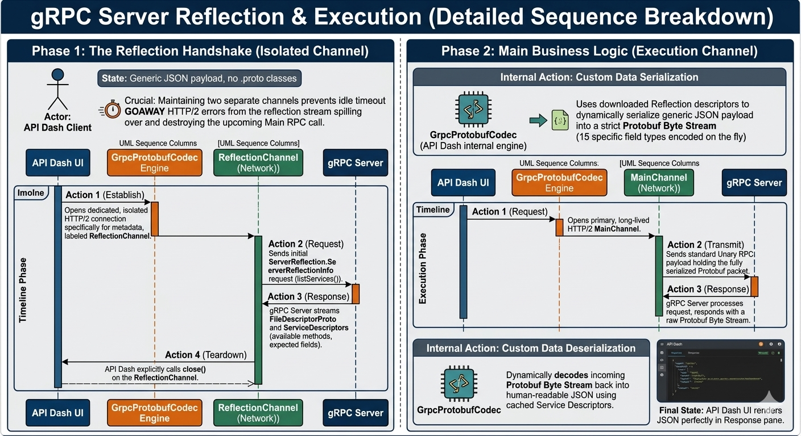

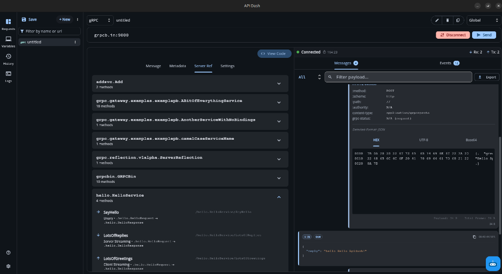
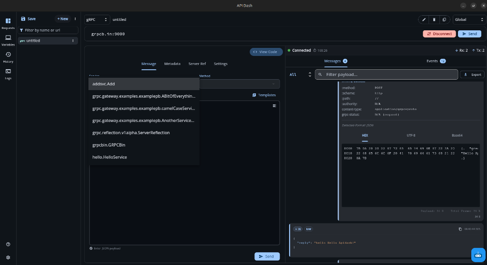

#### Specific Implementations & Trade-Offs:
- **Custom Dynamic Protobuf Encoder (15 Field Types):** Built a deep `_DynamicMessage` serializer computing bit-shifts and variable-length encoding (Types 1-18) natively without strictly compiled class bindings, guaranteeing dynamic JSON parity across arbitrary Reflection descriptors. By parsing the exact wire types over the buffer window, it completely skips reliance on generated classes:
  ```dart
  static (dynamic, int) _readFieldValue(Uint8List buffer, int offset, int wireType, $descriptor.FieldDescriptorProto field) {
    if (wireType == 0) return _readVarint(buffer, offset); // e.g., Int32, Int64, Uint32
    if (wireType == 1) return (Uint8List.sublistView(buffer, offset, offset + 8), offset + 8); // Double precision
    if (wireType == 5) return (Uint8List.sublistView(buffer, offset, offset + 4), offset + 4); // Float
    if (wireType == 2) { // Variable length strings/bytes
      final (len, newOff) = _readVarint(buffer, offset);
      final bytes = Uint8List.sublistView(buffer, newOff, newOff + len);
      if (field.type.value == 9) return (utf8.decode(bytes), newOff + len); 
      return (bytes, newOff + len); 
    }
    throw GrpcReflectionException('Unsupported wire type: $wireType');
  }
  ```
- **Server Streaming Subsystems:** Unlike standard JSON decoders, the gRPC execution layer natively attaches an infinite `call.response.listen` buffer bound to the UI to securely intercept, decode, and cascade infinite Server Streams on top of Standard Unary responses.
- **Dual-Channel Execution Prevention:** Reflection requests frequently trigger a particularly destructive HTTP/2 failure sequence. When the reflection stream is aborted or times out, the server emits an HTTP/2 `RST_STREAM` frame. If both the reflection query and the subsequent RPC call share the same HTTP/2 connection, the server may respond to the `RST_STREAM` with a `GOAWAY` frame - tearing down the **entire underlying TCP connection** and silently killing the in-flight Unary call. By isolating the Reflection handshake onto a dedicated `ReflectionChannel` that is explicitly `close()`d before opening the `MainChannel`, my implementation guarantees that `RST_STREAM` and `GOAWAY` frames from the reflection lifecycle can never propagate to the user's RPC execution.
- **TLS Configuration Toggle:** Implemented dynamic routing between secure (`https://`) and insecure (`http://`) gRPC channels via an explicit UI toggle natively integrated into the connection pipeline.
- **Reflection Service Tree Nav:** The UI will include a dedicated service tree browser allowing developers to systematically navigate and inspect reflection results - a graphical capability `grpcurl` cannot match.
- **`.pb` Binary Import Fallback - Why This Matters in Practice:** Most gRPC servers you encounter in staging and production have Server Reflection **disabled**. This is not an edge case - it is a deliberate security hardening decision. Operators disable Reflection to prevent external parties from enumerating internal service schemas, discovering undocumented endpoints, or fingerprinting their API surface. This means that in the real world, if your gRPC client relies exclusively on live Reflection to discover schemas (as most tools do), it silently breaks the moment you point it at any hardened service. The `.pb` binary import fallback solves this gap entirely. By accepting a pre-compiled `.pb` (binary `FileDescriptorSet`) generated offline via `protoc --descriptor_set_out`, the implementation unlocks the same schema-aware JSON editor and code generation pipeline without requiring a live Reflection endpoint - making API Dash functional against the production gRPC servers that actually matter.

---

## 7. Omni-Protocol Native Code Generator

**(A Core Feature I have extensively tested on `feat/gsoc-2026-protocol-support`)**

An IoT engineer who just validated their MQTT config in API Dash should be able to click 'View Code' and get a runnable paho-mqtt Python script (directly solving the code-gen expansion gaps highlighted in `#962` for protocol parity) - not manually reconstruct one from memory. Furthermore, I will implement payload export allowing users to seamlessly save Raw, JSON, and Protobuf message sequences to disk across all three protocols. Clicking "View Code" in API Dash currently only generates HTTP snippets. I have rewritten `protocol_code_pane.dart` to implicitly parse the active `APIType` and generate natively compilable test scripts:
- **WebSockets:** Outputs configuration limits into Python (`websockets`), Javascript (`ws`), and Dart (`dart:io`).
- **MQTT:** Maps Topic Arrays, Client IDs, and Publish payloads explicitly into Python (`paho-mqtt`), JavaScript (`mqtt`), and Dart (`mqtt_client`).
- **gRPC:** Synthesizes Unary channels mapping the parsed protobuf schemas explicitly into Python (`grpcio`), JavaScript, and Dart.

For example, for a WebSocket connection to `wss://echo.websocket.events`, clicking "View Code" produces a ready-to-run JavaScript snippet:

```javascript
const WebSocket = require('ws');

const ws = new WebSocket('wss://echo.websocket.events', {
  headers: { 'Origin': 'https://echo.websocket.events' }
});

ws.on('open', () => {
  console.log('[connected]');
  ws.send('Hello from API Dash');
});

ws.on('message', (data) => {
  console.log('[received]', data.toString());
});

ws.on('close', () => console.log('[disconnected]'));
ws.on('error', (err) => console.error('[error]', err.message));
```

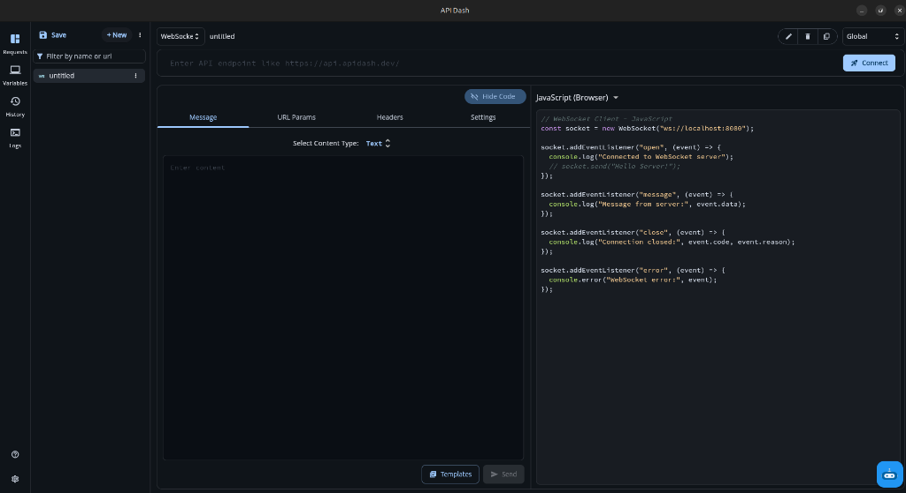

This guarantees absolute platform-wide parity, giving API Dash full code generation parity across all supported protocols. This is already implemented and tested on feat/gsoc-2026-protocol-support - not planned.

---

## 8. End-to-End Worked Example

To prove the production readiness of this architecture without requiring you to run the local PoC, consider a real-world scenario: an IoT engineer debugging an ESP32 accelerometer array publishing to a cloud broker. 

The engineer configures their connection in API Dash pointing at `broker.hivemq.com` using MQTT v3.1.1, and enters their credentials. They subscribe to the topic `sensors/accel/x` with QoS level 1, expecting a continuous stream of telemetry payloads resembling `{"x": 1.04, "y": 0.02, "z": 9.81, "ts": 1718043603}`. 

However, they accidentally mistype the broker password. When they hit "Connect", API Dash intentionally intercepts the byte-level connection acknowledgment and explicitly surfaces `CONNACK error: Bad User Name or Password` directly in the UI, exactly as parsed from the single-byte return code detailed in my protocol analysis. The developer gets precisely the actionable failure reason immediately instead of a generic timeout. 

After correcting the password, the connection succeeds and the raw JSON accelerometer payloads flood the client at 150 messages per second. The `MQTTGraphPainter` maps these incoming data points seamlessly onto a hardware-accelerated 60fps canvas. The status bar's real-time Rx/Tx counters update instantly alongside the graph, but crucially, because the counters are strictly bounded by Riverpod's O(1) equality checks on state emission, the application UI remains perfectly smooth and responsive without traversing the massive message array on every frame render.

Validating the data stream is working, the engineer now needs to codify that exact configuration into a script for their backend application. By simply clicking the "View Code" button, the Omni-Protocol Code Generator bypasses legacy HTTP routing entirely and dynamically constructs a runnable Python `paho-mqtt` script mapping the active topic structure, client ID, QoS, and payload handler. 

```python
import paho.mqtt.client as mqtt
import json

def on_connect(client, userdata, flags, rc):
    if rc == 0:
        print("Connected to broker")
        client.subscribe("sensors/accel/x", qos=1)
    else:
        print(f"Connection failed with code {rc}")

def on_message(client, userdata, msg):
    payload = json.loads(msg.payload.decode("utf-8"))
    print(f"[{msg.topic}] X: {payload['x']} Y: {payload['y']} Z: {payload['z']}")

client = mqtt.Client(client_id="apidash-171804", clean_session=True)
client.on_connect = on_connect
client.on_message = on_message

client.connect("broker.hivemq.com", 1883, 60)
client.loop_forever()
```

While the stream runs in the background, the engineer switches to the HTTP tab to trigger a backend database sync, then tabs back to the MQTT interface. The connection state remains fully live, the graph continues plotting uninterrupted, and no history is wiped. By scoping the connection manager to Riverpod family providers tied strictly to the request ID rather than the perishable widget scope, this architecture definitively resolves the state persistence failures that tanked previous PRs `#258` and `#210`.

---

## 9. What I Learned Building the PoC

Building `feat/gsoc-2026-protocol-support` was not a clean implementation sequence. It was a series of wrong assumptions, silent failures, and spec-level archaeology sessions. Here is what I actually learned - in the order I learned it the hard way.

### 1. Riverpod Background Providers "Silently Dying" (The Sync Trap)

I thought I had auto-connect working. The background isolate was receiving data, logs confirmed messages were flowing - and then I clicked to a different tab and came back. The connection status was reset, the message history was gone, and the Hive persistence had stopped recording mid-stream. No exception. No error log. The stream just stopped talking to the state tree.

My first assumption was a bug in the Hive write logic. I added logging at every write call - they were never reaching. Then I assumed a concurrency issue with the isolate. Spent two hours tracing async gaps. Nothing. The writes weren't failing - they were never being called.

The investigation that broke it open: I printed the provider's lifecycle events and watched `autoDispose` fire the moment the message feed widget scrolled out of the build tree during navigation. Riverpod was doing exactly what it was designed to do - aggressively garbage-collect providers with zero active widget listeners to prevent memory leaks. My background stream lost its only reference to the global state tree the moment the user left the tab.

The insight was that `autoDispose` is a feature, not a bug - but a live background connection is not a "disposable" resource. The fix required an explicit lifecycle tether: I injected a `ref.watch` call for the sync provider directly into the core `_MQTTResponsePaneState` build method, guaranteeing it stays alive for the full request lifecycle regardless of navigation:

```dart
@override
Widget build(BuildContext context) {
  // Activate the sync listener - ensures messages/events auto-save to Hive
  // even if the user is passively watching the graph.
  ref.watch(mqttStateSyncProvider); 
```

Zero data loss during background streaming, no memory leak - because the tether is scoped to the pane's own lifetime.

### 2. The MQTT v3.1.1 vs. v5.0 Payload Crash

My first MQTT publish function was a clean, generic method - one payload builder, one publish call, one conditional to route by protocol version. It worked fine on v3.1.1. The moment a user toggled the protocol switcher to v5.0 and hit publish, the app threw a type mismatch exception and crashed.

My assumption was that this was a simple enum mapping problem - that `mqtt_client` and `mqtt5_client` shared a common payload type and I had just mapped the QoS values incorrectly across packages. So I checked the enum values. They aligned fine. I re-read the publish call signatures. That's when I found the real problem: `mqtt_client` and `mqtt5_client` are not just different versions of the same library. The MQTT 5.0 specification introduced packet-level structural changes - dynamic Properties, extended reason codes, new frame fields - and the Dart ecosystem reflects this by shipping them as two completely separate packages with entirely incompatible `MqttPayloadBuilder` types that share no common supertype. There is no polymorphic base class. There is no shared interface. The two builders are architecturally unrelated.

The fix required abandoning the generic abstraction entirely. I explicitly split the service into `_clientV3` and `_clientV5` and mapped their discrete builders independently:

```dart
if (_clientV5 != null) {
  final builder = mqtt5.MqttPayloadBuilder()..addString(payload);
  _clientV5!.publishMessage(
    topic,
    mqtt5.MqttQos.values[qos.clamp(0, 2)],
    builder.payload!,
    retain: retain,
  );
} else {
  final builder = mqtt3.MqttClientPayloadBuilder()..addString(payload);
  _clientV3!.publishMessage(
    // ... maps to mqtt3 enums
```

This forces strict type safety across protocol boundaries at compile time, not at runtime.

### 3. Parsing CONNACK Error Codes Gracefully

While building *Titan Personal Assistant* - my production IoT system connecting ESP32 microcontrollers to a Python/Flask backend over MQTT - I kept hitting a frustrating failure mode: the connection would drop, the client would report a generic error, and I had no idea if the broker was rejecting my credentials, banning my client ID, or dropping the connection for a network reason. All three failures looked identical in the client output.

I went to the MQTT v3.1.1 specification expecting a table of error strings. What I found instead in [§3.2.2.3](https://docs.oasis-open.org/mqtt/mqtt/v3.1.1/mqtt-v3.1.1.html#_Toc398718035) was the real reason every client surfaces the same generic failure: the spec encodes return codes as a **single byte with no accompanying string field**. CONNACK code `4` (bad credentials) and code `5` (unauthorized client) look absolutely identical at the socket level - both close the TCP connection immediately, both carry no human-readable explanation. Every API client implementation, including the old PR `#258`, was surfacing the same generic "connection failed" message for both because there is no string to extract.

Understanding the spec directly - rather than relying on the library's default error string - was what made the difference. I brought that same byte-level decoding directly into API Dash's parser, with explicit v5.0 extension support for the arbitrary Reason String field the newer spec added:

```dart
static String _connackErrorV5(mqtt5.MqttConnectionStatus? status) {
  final reason = mqtt5.MqttConnectReasonCodeSupport.mqttConnectReasonCode.asString(status?.reasonCode);
  final reasonString = status?.reasonString;
  if (reasonString == null || reasonString.isEmpty) {
    return 'CONNACK error: $reason';
  }
  return 'CONNACK error: $reason ($reasonString)';
}
```

API Dash now surfaces exact, actionable broker failure reasons - not generic connection errors - while natively respecting both the v3.1.1 fixed-byte encoding and the v5.0 arbitrary Reason String extension.

### 4. Real-time Metrics (Rx/Tx) Lagging the Main Thread

The live Rx/Tx counters in the status bar looked trivial to implement - just count incoming and outgoing messages, display them. I wired them up as computed values inside the status bar widget's `build()` method and tested against a real broker. At low message rates everything was smooth. I then connected to a simulated IoT sensor feed pushing 150 messages per second and watched the UI stutter to the point of becoming unusable.

My first instinct was that the problem was the `CustomPaint` graph - too many canvas operations per frame. I profiled the rendering pipeline. The graph was fine. The frame time spike was happening in the status bar, not the canvas. What I was doing inside `build()` was iterating over the full `messages` list with `where((m) => m.isIncoming).length` on every render frame. At 150 messages/second, that is O(n) list traversal running at 60fps - a combinatorial budget violation that grows worse as the session continues.

The insight came from studying how Riverpod's equality check works. Because `mqttMessagesProvider` emits a new immutable list reference on every state change via `copyWith`, Riverpod's upstream equality check operates on the reference itself - `O(1)` - not on the list contents. By watching `mqttMessagesProvider` inside a `ConsumerWidget` rather than computing counts inline in `build()`, the `where().length` filter runs exactly once per state emission, never once per frame. The counter re-evaluates only when new data arrives, not on every animation tick.

```dart
// This caps the _StatusBar UI render cost at O(1) during idle periods
// regardless of history size - re-evaluates only on state emission, never per frame.
```

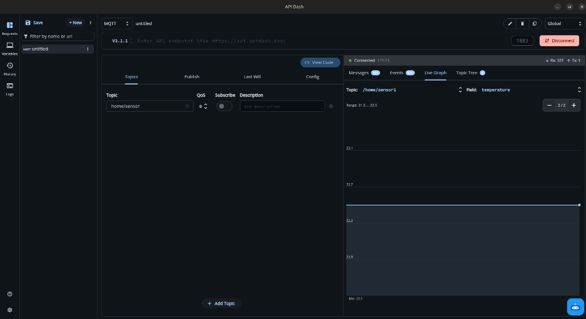

### 5. Code Generation UI Stalling on Unrecognized Protocols

I wired the "View Code" button across all three protocol panes and tested the WebSocket generator first - it worked immediately. Then I tested MQTT. The code pane opened but rendered nothing. No error, no exception, just a blank panel. I assumed the template rendering logic had a null-check issue and started tracing the template string generation. All the data was there - the topic array, client ID, payload - but nothing was reaching the display layer.

The investigation led me to API Dash's legacy `CodePane` implementation. The existing code explicitly validated generation paths against URL protocol schema strings - `http` and `https`. Any URI structure it did not recognize (`wss://`, `mqtt://`) triggered a terminal fallback that halted the widget build silently. The code pane was not failing to render - it was hitting a branch that returned an empty widget before the template ever ran.

The fix required bypassing the legacy URI parser entirely. I engineered a dedicated `protocol_code_pane.dart` that intercepts the strictly typed `requestModel.apiType` enum at the button layer - upstream of any URI parsing - and feeds it directly into dedicated syntax mappers for `grpcio` and `paho-mqtt`. The URL string is never consulted for the generation path decision.

### 6. Stale Provider Reference After WebSocket Reconnect

Everything about the WebSocket reconnect flow looked correct in isolation. The disconnect path cleaned up the stream subscription, closed the channel, and reset the Riverpod state. The reconnect path re-initialized `WebSocketConnectionManager`, created a new channel, and set the status back to `connected`. In a simple test - connect, disconnect, reconnect - it worked fine.

The failure appeared only under a specific sequence: connect, send a message, navigate away from the request tab (triggering a partial widget rebuild), navigate back, then reconnect. After that sequence, the send button would re-enable, the UI would show `connected`, and then any message sent would silently vanish - no network activity, no error.

I assumed the issue was in the new channel initialization - that the `await channel.ready` was resolving too early in some race condition. I added explicit delay logging around the handshake. The channel was completing its handshake correctly and the ready future was resolving as expected. The send path was receiving the call.

The actual problem surfaced when I logged which `WebSocketConnectionManager` instance the send path was referencing: it was holding a reference to the **old, closed instance** - not the newly created one. When the provider was partially rebuilt during tab navigation, the widget subtree had captured the manager instance at build time and never re-read it after reconnect. The `ConnectionManager` itself had been replaced, but the widget's captured reference still pointed at the dead one. Messages were being written into a closed channel that had already had its stream cancelled - which is not an exception, it is just a no-op.

The fix required the connection manager lookup to always go through the provider reference at call time, never through a captured instance variable. Every send operation now re-reads the manager via `ref.read(wsConnectionManagerProvider(requestId))` at the moment of the call, guaranteeing it always talks to the live instance regardless of what navigation events happened between connect and send.

---

## 10. Comprehensive Project Timeline (March 1 - April 15)

> **Note on Attached/Related Proposals:** 
> This proposal (Protocol Support) serves as my primary GSoC submission and foundation. Over the past weeks, I have also architected and documented two major extensions covering headless capabilities. You can review them for detailed architecture on those features:
> - **[APIDash Headless CLI & MCP Server Integration (Dart Native)](../../../../../application_roshan_mcp_cli_dart.md)** (My complete Dart-rewrite)
> - **[APIDash Headless CLI & Model Context Protocol (MCP) Integration (TypeScript PoC)](../../../../../../gsoc-poc/2026/application_roshan_mcp_cli_typescript_support.md)**

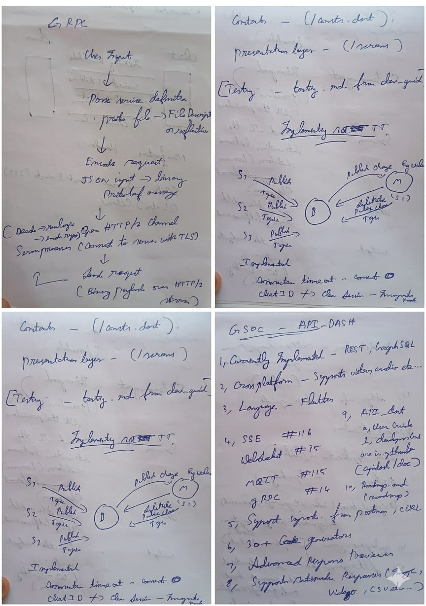

### Week 1: Core Systems & Data Architecture (March 1 - March 7)
- **Objective:** Establish the production-ready Hive and Riverpod foundation.
- **Tasks:** 
  - Register and test Hive type adapters for `MqttRequestModel`, `WebSocketRequestModel`, and `GrpcRequestModel`.
  - Wire all three models into the core `requests_notifier.dart` pipeline.
  - Deliver: `hive_migration_test.dart` and `collection_isolation_test.dart` verifying that protocol-specific states are strictly isolated and persist correctly across app restarts.

### Week 2: WebSocket Ephemeral Mechanics & UI (March 8 - March 14)
- **Objective:** Finalize a robust WebSocket engine with full spec compliance.
- **Tasks:**
  - Implement `WebSocketConnectionManager` with explicit `channel.ready` handshake handling.
  - Build the duplex chat-bubble UI with real-time Rx/Tx counters.
  - Map HTTP upgrade failures to actionable SnackBars.
  - Deliver: `ws_manager_test.dart` and `ws_ui_integration_test.dart` covering handshake timing and tab-navigation state persistence.

### Week 3: MQTT Intelligence Metrics & Live Visualization (March 15 - March 21)
- **Objective:** Deploy the dual-engine MQTT client and hardware-accelerated graphing.
- **Tasks:**
  - Implement full support for MQTT v3.1.1 and v5.0 with specialized payload builders.
  - Construction of the 4-tab MQTT configuration interface (Topics, Publish, LWT, Config).
  - Develop the `CustomPaint` `MQTTGraphPainter` for 60-fps live data plotting.
  - Deliver: `mqtt_service_test.dart` and `mqtt_graph_render_test.dart` for protocol switching and frame-timing validation.

### Week 4: gRPC Integration, Codegen & Final Polish (March 22 - March 31)
- **Objective:** gRPC Server Reflection, Omni-Protocol Codegen, and production sign-off.
- **Tasks:**
  - Implement dual-channel gRPC isolation (Reflection vs. Execution) to prevent TCP connection drops.
  - Rewrite `protocol_code_pane.dart` to support Python, JS, and Dart codegen for all three protocols.
  - Execute final widget boundary testing for mobile overflow stability and write comprehensive user docs.
  - **March 31:** Finalized drafted proposal and submitted to GSoC 2026.
  - **April 9, 2026:** Fixed Issue [#1090](https://github.com/foss42/apidash/issues/1090) (Divider snapping bug) while maintaining full architectural integrity and preserving existing core features.
  - Deliver: Complete `codegen_integration_test.dart` and finalized core feature set merging into the main branch.

### Week 5: Headless CLI & MCP Server Architecture (April 1 - April 7)
- **Objective:** Establish the Decoupled Sibling Architecture and Cloud Deployment.
- **Tasks:**
  - **Monorepo Architecture & State Sync (April 1-3):** Finalized the Decoupled Sibling Architecture by extracting `apidash_mcp_core`. Implemented Dart `McpSyncService` for bi-directional file synchronization between Flutter and headless tools.
  - **Cloud Deployment (April 4-5):** Containerized and deployed serverless MCP architecture onto Amazon Bedrock AgentCore.
  - **Transport & Security (April 6):** Implemented `StreamableHTTPServerTransport`, `SSEServerTransport`, and `ToolHashRegistry`. Completed RFC 8414 OAuth 2.1 Metadata Discovery flow.
  - **April 7:** Resolved integration issues including Copilot cache busting and UI iframe polling.

### Week 6: Native Dart MCP Pivot & Interactive TUI (April 8 - April 15)
- **Objective:** Complete the native Dart port for the MCP & CLI tools and finalize the interactive TUI.
- **Tasks:**
  - **April 8:** Submitted final GSoC 2026 Proposal PR. Decided to pivot implementation from TypeScript to native Dart to align with APIDash's ecosystem. Bootstrapped `feat/gsoc-2026-cli-mcp-dart-support`.
  - **Dart MCP Foundation (April 9-11):** Ported all 14 MCP tool handlers from TypeScript to idiomatic Dart (`mcp_dart`) with zero Flutter dependency leakage.
  - **UI Panels & OAuth 2.1 (April 12):** Fixed iframe sandbox CSP violations and completed the OAuth 2.1 PKCE standalone flow for the Dart MCP server.
  - **Stability Fixes (April 13):** Tuned `StreamableHTTPServerTransportOptions` to resolve VS Code’s initialize handshake errors payload issues.
  - **TUI Completion (April 14):** Finalized the Terminal UI (`apidash_cli`) including keyboard-navigable menus, paginated request lists, and a flicker-free viewport setup.
  - **April 15:** Submitted the updated proposal integrating all Native Dart MCP & CLI improvements.

---

## 11. About Me

My name is **Roshan Melvin G A**, and I am a third-year Computer Science engineering student (CGPA: 8.27) specializing in IoT at Sri Sairam Engineering College, Chennai. I am currently completing an engineering internship at [Mastek](https://www.mastek.com/). Throughout my academic journey, I have consistently engaged in projects and activities aimed at enhancing my skills and applying my knowledge in real-world robust software scenarios.

### Personal Projects

- **Titan Personal Assistant**: I architected a production IoT system connecting ESP32 microcontrollers to a Python/Flask backend over rapid MQTT pub/sub loops with facial recognition auth. Debugging those raw protocol sessions without an intuitive GUI client is what motivated this GSoC proposal in the first place. The dev.to article I published on the `channel.ready` timing trap in Dart is external evidence of that protocol-level research: [Why Your WebSocket Messages Silently Vanish](https://dev.to/roshan_melvin/why-your-websocket-messages-silently-vanish-the-channelready-trap-in-dart-3mi5).
- **SelfieMtrx**: Fully developed and actively patented a production AI Image Analysis application built purely in Flutter.
- **ROS2 Teleoperation Systems**: Architected low-level robotic controls for Adapt Robotics, incubated at Sri Sairam Techno Incubator Foundation.

### Hackathons

I actively participate in hackathons to challenge myself, architect complex systems rapidly, and collaborate with peers:
- **[1st Place - DeepBlue Season 10 National Hackathon](https://deepblue.co.in/wp-content/uploads/2025/08/season-10-winner-4.webp)**: National-level competitive hackathon victory spanning multiple problem domains.
- **[IEEE HKN Global Hackathon 2025](https://hkn.ieee.org/alumni-news/2026/02/engineering-a-shared-future-the-2025-ieee-hkn-global-hackathon)**: Participated in the globally recognized IEEE HKN challenge, engineering systems for a shared future. I have also submitted a core research paper to the Sri Sairam IEEE HKN Student Conference (awaiting results).

### Experience with Flutter & Dart

I have been practicing advanced Flutter architectures and Dart extensively, honing my problem-solving and logic optimization skills. This experience enables me to write efficient, scalable, and memory-safe code, which is essential when contributing to large-scale products like API Dash. I am the author of open PR `#1529` (8 commits, 69 files, **+17,693 lines**) submitted directly against `foss42:main`. Through these contributions, I have gained practical experience collaborating on open-source, adhering to code review standards, and making meaningful improvements to the API Dash ecosystem.

### Key Qualities

I am highly consistent and possess a dedicated mindset. I take ownership of my work and am committed to delivering results within the given timeframe. You can rely on me to stay focused and ensure the successful and timely completion of the project.

---

## 12. Communications

I am comfortable with any communication channel. For text communication, I prefer **Discord** and **Email**. For video calls and pair programming sessions, I prefer using **Google Meet**.

During the summer, as I will have no academic commitments, I will be dedicating **40-50 hours per week** (approximately **7-8 hours on weekdays** and **5-6 hours on weekends**). In case of any delays or blockers, I will promptly communicate with my mentors to discuss the issue and find a solution. I am also willing to work overtime if necessary to meet the project goals. I have explicitly set aside the final week of the timeline as a buffer to accommodate any unforeseen adjustments.

- **Timezone:** IST / GMT +5:30 (Indian Standard Time)
- **Working Hours:** Flexible, typically 10:00 AM – 8:00 PM IST
- **Email:** rocroshanga@gmail.com
- **Phone:** +91-7826860136
- **Discord:** `roshanmelvin`

---

## 13. Feedback from API Dash

*If you have read this proposal, please provide your short general feedback in the section below. Feel free to make comments anywhere above as well.*

| Reviewer Username | Date | Comment |
|:---|:---|:---|
| *(reviewer)* | *(date)* | *(feedback here)* |
| *(reviewer)* | *(date)* | *(feedback here)* |
| *(reviewer)* | *(date)* | *(feedback here)* |
